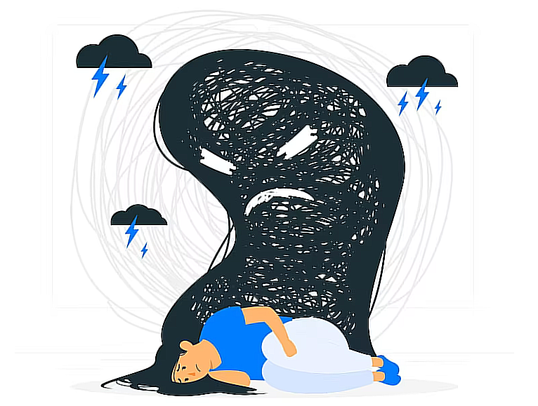

# <div id="top" align ="center">

</div>

<div align="center">

[![Contributors][contributors-shield]][contributors-url]
[![Forks][forks-shield]][forks-url]
[![Stargazers][stars-shield]][stars-url]
[![Issues][issues-shield]][issues-url]

</div>

<!-- PROJECT LOGO -->
<br />
<div align="center">
  <a href="https://github.com/nghganhtu/Depression-Classification">
    
  </a>

  <h3 align="center">Depression Classification</h3>
  <h4 align="center">BetterDay Universe</h4>

  <p align="center">
    The system for predicting and classifying depression levels based on 5 different types of daily pressure is written in Python and uses algorithm models in Scikit Learn. Posted in the VNICT conference with the name "Analysis and implementation of machine learning to forecast Vietnamese students' depression levels"
    <br />
    <br />
    <!-- <a href="https://youtu.be/iLo5E-07aY0">View Demo</a> -->
  </p>
</div>

<!-- TABLE OF CONTENTS -->
# Table of contents :round_pushpin:
1. [Introduction](#Introduction)
2. [Techniques](#Techniques)
3. [Features](#Features)
4. [Challenges](#Challenges)
5. [Acknowledgments](#Acknowledgments)

## Introduction <a name="Introduction"></a> :bricks:

<div align="center">

</div>

<div style="text-align:justify">

The 4.0 phase is characterized by an illness called depression. Vietnam in particular and the rest of the world are experiencing a surge in depression, particularly among young people. In today's modern world, the idea of depression is no longer odd, but rather becoming more and more ubiquitous. Depression is a psychological illness that has a significant negative impact on the patient's brain but has no physical symptoms. Depression affects a person's feelings, emotions, thoughts, and behaviors in varying degrees of severity, ranging from mild to severe. Numerous recent research conducted in the United States and abroad concentrate on data regarding the prevalence of depression as well as its symptoms, risks, and treatments at each level. Most domestic and international scientific study is based on medical data. Moreover, in our report, we will use various tools to analyze and make a conclusion about depression in Vietnam, particularly from the age of 18 -22.

</div>

### Everything done by me!


### Installation :dart: 

1. Open the terminal on your IDE
2. Clone the repo
   ```sh
   git clone https://github.com/nghganhtu/Depression-Classification.git
   ```
3. Check the file status
   ```sh
   git status
   ```
4. Change branch
   ```js
   git checkout 'branch_name'
   ```

### Motivation :mechanical_arm:

<div style="text-align:justify">

Motivation is what drives us to succeed in life, and when it comes to computer science, algorithms & data structures provide the necessary tools to achieve that success. The classic game of Battleship relies heavily on these concepts as players must efficiently search through a grid of potential targets while maximizing their chances of hitting the opponent's ships. Optimization is key in this game, as slow searching can mean the difference between victory and defeat. This is where algorithms come into play - by implementing sophisticated searching techniques such as binary search or A* search, players can quickly traverse the board and locate enemy ships with minimal effort. Likewise, data structures like hash tables assist in storing player moves for easy retrieval later on. In combining these methods with strategic planning and intuition, players can become masters of modern-day Battleship strategy.

</div>


<br />

## Techniques <a name="Techniques"></a>:joystick:
- Language: [Python](https://www.python.org)
- Library: [Scikit Learn](https://scikit-learn.org/stable/)


<br />


<!-- FEATURES -->
## Features <a name="Features"></a>:joystick: 
- Completed: System
- Incompleted: A website 
<br />

<!-- CHALLENGES -->
## Challenges<a name="Challenges">:bangbang:

- Collecting Data
- Building a new website
<br />
	
## Acknowledgments<a name="Acknowledgments">:brain:
<div style="text-align:justify">

This work was supported by International University,
VNU-HCM under grant number SV2021-IT-05 :heart:

</div>

<br />


<br />

<p align="right">(<a href="#top">Back to top</a>)</p>

